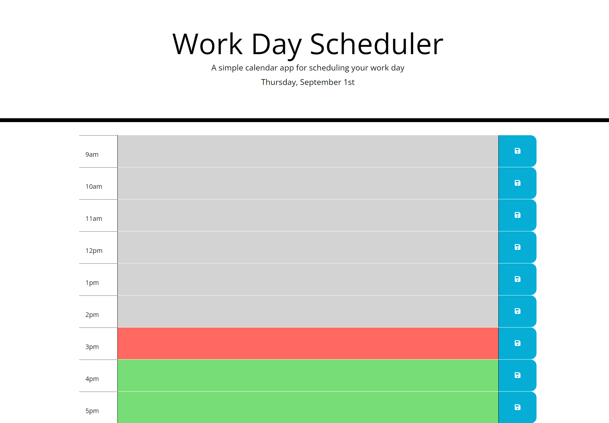

# green-day-calendar

## Discription 

This prodject was to create a daily planner that you can schedule your day. With the current date always displaying at the top of the calendar. The calender should have blocks of time that you can save messages in. The blocks of time should also be color coded based of past, present, and future of current hour. I created this using bootstrap, qjuery, and fontawsomeness. 

## Mock-up

## Deployment Links

Deploy - https://mrgreen12375.github.io/green-day-calendar/

GitHub Repo -  https://github.com/mrgreen12375/green-day-calendar